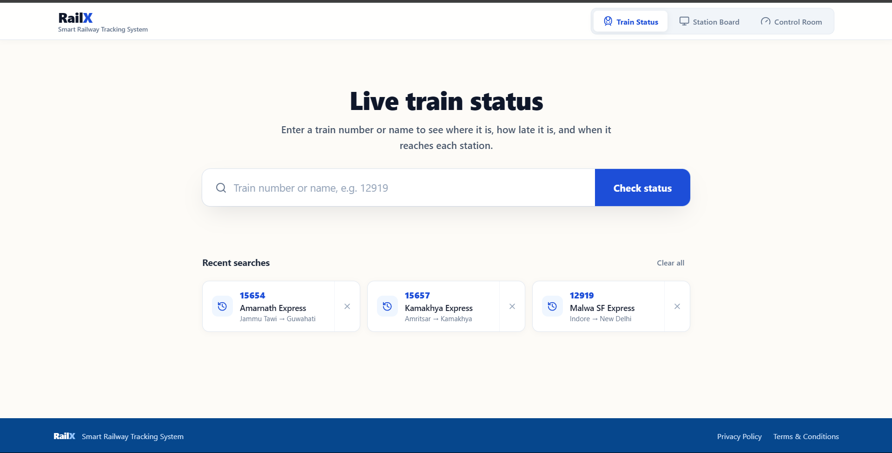

<div align="center">


# RailX

**Smart Railway Tracking System**

Live train status for Indian Railways routes: where a train is, how late it is,
and when it reaches each station.

</div>



## What it does

RailX has three views.

| View | Question it answers |
|---|---|
| **Train Status** | Where is my train, how late is it, and when will it reach each station? |
| **Station Board** | Which trains are arriving at or leaving a station in the next few hours? |
| **Control Room** | Where are all running trains across the network right now? |

On a train's page you get the current location, delay, a route map, and the arrival and
departure time for every stop. Passed stations are collapsed so the next stop is always at
the top. The interface works on phones as well as desktops.

| Station Board | Control Room |
|---|---|
|  |  |

## How it works

```
RailRadar API ──┐
                ├──►  Backend (Spring Boot, :8080)  ──►  Frontend (React, :5173)
OpenWeatherMap ─┘          │            ▲
                           ▼            │
                    ML service (FastAPI, :8000)
                           │
                     PostgreSQL (:5432)
```

1. The **backend** fetches live train data from RailRadar and weather from OpenWeatherMap. A
   scheduled job refreshes the trains in `ACTIVE_TRAIN_NUMBERS` every 5 minutes and stores
   positions, delays and predictions in PostgreSQL.
2. For an arrival prediction, the backend builds a feature vector and sends it to the **ML
   service**, which returns the remaining minutes, a lower and upper bound, and a confidence
   score. If the ML service does not respond, the backend uses a built-in formula instead and
   marks the result `FALLBACK_MOCK`.
3. The **frontend** calls the backend through `/api` on its own address. The Vite dev server
   forwards those calls to the backend, so the app also works when opened from another device
   on your network.

### Prediction

The ML service combines three estimates and adds adjustments:

```
live speed   = 0.40 × current speed + 0.60 × average speed over the last 5 minutes
speed ETA    = remaining distance ÷ live speed

base ETA     = 0.40 × scheduled remaining time
             + 0.25 × historical section time (scheduled time when unknown)
             + 0.35 × speed ETA

predicted    = base ETA + delay adjustment + rainfall adjustment + congestion adjustment
```

The delay adjustment comes from an XGBoost regressor. Rainfall adds 0, 2, 5 or 10 minutes
depending on the amount, and congestion adds up to 15 minutes. The bounds and confidence
score widen with the train's historical delay rate and the congestion level.

**Accuracy has not been validated yet.** The regressor was trained with the target value
among its inputs and scored on its own training data, so the metrics saved during training
are not meaningful. [PERFORMANCE.md](PERFORMANCE.md) explains the problem, shows what the
model does without that input, and lists the steps to a valid evaluation.

## Getting started

### Requirements

- Docker with Docker Compose
- A RailRadar API key and an OpenWeatherMap API key

### Run with Docker Compose

```bash
git clone https://github.com/Jayantaxnath/railway-eta-prediction-system.git
cd railway-eta-prediction-system

cp .env.example .env
cp docker-compose.yml.example docker-compose.yml
```

1. In `.env`, set `RAILWAY_API_KEY`, `OPENWEATHER_API_KEY` and a database password.
2. The example Compose file does not publish any ports. In `docker-compose.yml`, add
   `ports: ["5173:5173"]` to the `frontend` service. Add `8080:8080` to `backend` or
   `8000:8000` to `ml-service` if you want to call those services directly.
3. Start everything:

```bash
docker compose up --build
```

Open http://localhost:5173. The backend needs about 30 seconds to start, and the frontend
waits until it is healthy.

### Run without Docker

You need PostgreSQL 16, Python 3.11, Java 21 with Maven, and Node 20.19+ or 22.12+.

```bash
# ML service
cd ml-service
pip install -r requirements.txt
uvicorn main:app --port 8000

# Backend (in a second terminal)
cd backend
export POSTGRES_USER=... POSTGRES_PASSWORD=... RAILWAY_API_KEY=... OPENWEATHER_API_KEY=...
mvn spring-boot:run

# Frontend (in a third terminal)
cd frontend/railway-frontend
npm install
npm run dev
```

The backend connects to the database `sih` on `localhost:5432` unless `POSTGRES_HOST`,
`POSTGRES_PORT` or `POSTGRES_DB` say otherwise.

## Configuration

| Variable | Default | Purpose |
|---|---|---|
| `RAILWAY_API_KEY` | none | RailRadar API key |
| `OPENWEATHER_API_KEY` | none | OpenWeatherMap API key |
| `POSTGRES_HOST`, `POSTGRES_PORT`, `POSTGRES_DB` | `localhost`, `5432`, `sih` | Database location |
| `POSTGRES_USER`, `POSTGRES_PASSWORD` | set these yourself | Database login |
| `ML_API_URL` | `http://localhost:8000` | Address of the ML service |
| `ML_API_TIMEOUT` | `10000` | Defined but not read yet; the ML request timeout is fixed at 10 seconds in `MlApiClient` |
| `ACTIVE_TRAIN_NUMBERS` | `12919,12920` | Trains the scheduled job refreshes |
| `TRAIN_DATA_FETCH_INTERVAL` | `300000` | Refresh interval in milliseconds |
| `VITE_API_BASE_URL` | empty | Backend address for the frontend. Leave empty to use the `/api` proxy. |

## API

The main backend endpoints, all under `/api`:

| Method | Path | Returns |
|---|---|---|
| GET | `/trains/search?q=` | Trains matching a number or name |
| GET | `/trains/{number}` | Stored train details |
| GET | `/trains/{number}/live-data?date=` | Live status and route from RailRadar |
| GET | `/trains/{number}/schedule` | Timetable |
| GET | `/trains/{number}/geometry` | Route line and stops as GeoJSON |
| GET | `/trains/{number}/positions` | Stored position history |
| GET | `/trains/{number}/features` | Feature vector sent to the ML service |
| GET | `/trains/{number}/eta` | Latest stored prediction |
| GET | `/trains/{number}/eta/history` | All stored predictions |
| POST | `/trains/{number}/eta/predict` | Runs a new prediction and stores it |
| GET | `/trains/live-map` | Positions of all running trains |
| GET | `/stations/search?q=` | Stations matching a code or name |
| GET | `/stations/{code}/live?hours=` | Arrivals and departures, default 4 hours |

The ML service has `POST /predict-eta` and `GET /health`. Interactive documentation is at
http://localhost:8000/docs when that port is published.

## Tests

```bash
cd backend
mvn test
```

There are 12 test classes, including an end-to-end pipeline test that uses an in-memory H2
database, so PostgreSQL is not needed. `ml-service/tests/test_api.py` sends 10 example requests
to a running ML service.

## Project structure

```
backend/                    Spring Boot API, scheduler, database access (Java 21)
frontend/railway-frontend/  React app (Vite, Leaflet)
ml-service/                 FastAPI prediction service, models and training script
shared-contracts/           JSON schemas and feature spec shared by all three services
data/                       Notes on the datasets used for training
scripts/                    Latency benchmark
offline_view_lastest_ui/    Screenshots of the current interface
PERFORMANCE.md              Measured performance and model evaluation
```

## Documentation

- [PERFORMANCE.md](PERFORMANCE.md): latency, bundle size, resource use and model evaluation
- [ml-service/MODEL_PIPELINE.md](ml-service/MODEL_PIPELINE.md): how the prediction service works
- [ml-service/GUIDE.md](ml-service/GUIDE.md): calling the ML service from another program
- [shared-contracts/README.md](shared-contracts/README.md): data contracts between services
- [CONTRIBUTORS.md](CONTRIBUTORS.md): who built what

## License

[MIT](LICENSE). Map data © OpenStreetMap contributors.
